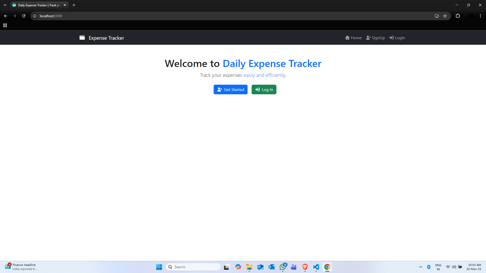

# Daily Expense Tracker

A lightweight, full-stack web application that helps users securely record, manage, and analyze personal expenses with an intuitive dashboard and quick reporting features.

<p align='center'>

</p>

##  Project Overview

Daily Expense Tracker is a simple yet powerful expense management system built with modern web technologies. It allows users to:

- **Register & Login** — Create an account and securely authenticate
- **Add Expenses** — Log new expenses with date, item description, and cost
- **Manage Expenses** — View all expenses in a clean table format
- **Edit Expenses** — Update existing expense entries
- **Delete Expenses** — Remove unwanted expense records
- **Search Expenses** — Find expenses by keyword, date range, or category
- **Change Password** — Update account credentials anytime
- **Dashboard** — Get a quick overview of expense activity

##  Tech Stack

### Frontend
- **React** — Modern UI framework with hooks and component-based architecture
- **React Router** — Client-side routing for navigation
- **react-toastify** — Toast notifications for user feedback
- **Bootstrap & Font Awesome** — UI styling and icons
- **Fetch API** — HTTP client for backend communication

### Backend
- **Django** — Python-based web framework for rapid development
- **Django ORM** — Database object-relational mapping
- **SQLite** — Lightweight database for local development (included)
- **Python 3** — Core language

##  Project Structure

```
Daily Expense Tracker/
├── BackEnd/
│   ├── db.sqlite3
│   ├── manage.py
│   ├── BackEnd/
│   │   ├── settings.py
│   │   ├── urls.py
│   │   ├── wsgi.py
│   │   └── asgi.py
│   ├── expense/
│   │   ├── models.py         # UserDetails, ExpenseDetails
│   │   ├── views.py          # API endpoints
│   │   ├── urls.py           # URL routing
│   │   ├── admin.py
│   │   └── migrations/
│   └── README.md             # Backend API 
│
├── FrontEnd/
│   └── frontend/
│       ├── package.json
│       ├── public/
│       ├── src/
│       │   ├── App.js
│       │   ├── index.js
│       │   └── components/
│       │       ├── Signup.js
│       │       ├── Login.js
│       │       ├── Dashboard.js
│       │       ├── AddExpense.js
│       │       ├── ManageExpense.js
│       │       ├── ExpenseReport.js
│       │       ├── ChangePassword.js
│       │       ├── Navbar.js
│       │       └── Home.js
│       └── README.md          # Frontend 
│
└── README.md                  
```

##  Quick Start

### Prerequisites

- **Node.js** (v14+) and **npm** — [Download](https://nodejs.org/)
- **Python 3** (v3.8+) — [Download](https://www.python.org/)
- **Git** — [Download](https://git-scm.com/)

### 1. Backend Setup (Django)

Open PowerShell and navigate to the backend folder:

```powershell
cd 'C:\Users\hp\Desktop\Daily Expense Tracker\BackEnd'
```

Create a virtual environment (optional but recommended):

```powershell
python -m venv venv
.\venv\Scripts\Activate.ps1
```

Install Django and dependencies:

```powershell
pip install django
```

Run migrations (apply database schema):

```powershell
python manage.py migrate
```

Start the Django development server (runs on `http://localhost:8000`):

```powershell
python manage.py runserver
```

You should see output like:
```
Starting development server at http://127.0.0.1:8000/
```

### 2. Frontend Setup (React)

Open **another PowerShell terminal** and navigate to the frontend folder:

```powershell
cd 'C:\Users\hp\Desktop\Daily Expense Tracker\FrontEnd\frontend'
```

Install dependencies:

```powershell
npm install
```

Start the React development server (runs on `http://localhost:3000`):

```powershell
npm start
```

The app will automatically open in your browser at `http://localhost:3000`.

##  API Endpoints

All endpoints are prefixed with `http://localhost:8000/api/`

### Authentication
- `POST /signup/` — Register a new user
- `POST /login/` — Login and get userId
- `POST /change_password/` — Change account password

### Expense Management
- `POST /add_expense/` — Create a new expense
- `GET /manage_expense/<user_id>/` — List all expenses for a user
- `PUT /update_expense/<expense_id>/` — Update an expense
- `DELETE /delete_expense/<expense_id>/` — Delete an expense
- `POST /search_expense/` — Search expenses by criteria

For detailed API documentation, see `BackEnd/README.md`

##  Communication Between Frontend & Backend

1. **Frontend** (React on port 3000) sends HTTP requests to **Backend** (Django on port 8000)
2. Backend processes requests and returns JSON responses
3. Frontend displays results in components and stores user info in `localStorage`

**Example flow:**
```
User signup → Frontend POST to /api/signup/ → Backend validates & stores user → Returns success message → Frontend redirects to login
```

##  Configuration

### CORS (Cross-Origin Resource Sharing)

If you encounter CORS errors when the frontend calls the backend, install and configure `django-cors-headers`:

```powershell
pip install django-cors-headers
```

Then add to `BackEnd/BackEnd/settings.py`:

```python
INSTALLED_APPS = [
    ...
    'corsheaders',
    ...
]

MIDDLEWARE = [
    'corsheaders.middleware.CorsMiddleware',
    ...
]

CORS_ALLOWED_ORIGINS = [
    "http://localhost:3000",
]
```

### Environment Variables (Optional)

Create a `.env` file in `FrontEnd/frontend/` for API configuration:

```
REACT_APP_API_BASE_URL=http://localhost:8000/api
```

Then update component fetch calls to use this variable:

```js
const API_BASE = process.env.REACT_APP_API_BASE_URL || 'http://localhost:8000/api';
```

##  Database Models

### UserDetails
- `FullName` — User's full name
- `Email` — Unique email address (login credential)
- `Password` — User password (stored as plain text in current version)
- `RegDate` — Registration timestamp

### ExpenseDetails
- `UserId` — Foreign key to UserDetails
- `ExpenseDate` — Date of the expense
- `ExpenseItem` — Name/description of the expense
- `ExpenseCost` — Amount spent (float)
- `NoteDate` — When the expense was recorded

##  Security Notes

 **Current Limitations (Development Only):**
- Passwords are stored in **plain text** — migrate to hashed passwords before production
- CSRF protection is disabled (`@csrf_exempt`) — use Django's CSRF middleware for production
- No token-based authentication — consider JWT or Django Rest Framework

**Recommendations for Production:**
- Use Django's built-in `make_password()` and `check_password()` for password hashing
- Enable CSRF tokens and use Django sessions or JWT for authentication
- Switch to HTTPS
- Validate and sanitize all user inputs
- Use environment variables for sensitive configuration

##  Testing

### Frontend
```powershell
cd 'C:\Users\hp\Desktop\Daily Expense Tracker\FrontEnd\frontend'
npm test
```

### Backend
```powershell
cd 'C:\Users\hp\Desktop\Daily Expense Tracker\BackEnd'
python manage.py test
```

## Troubleshooting

| Issue | Solution |
|-------|----------|
| Backend won't start | Ensure Python is installed and in PATH. Run `python --version` to verify. |
| Frontend won't start | Ensure Node.js is installed. Run `npm --version` to verify. |
| CORS errors | Install `django-cors-headers` and configure as shown in Configuration section. |
| Port 3000 already in use | Kill the process using `npx kill-port 3000` or change port in React config. |
| Port 8000 already in use | Run Django on a different port: `python manage.py runserver 8001` |
| Login fails | Verify the backend is running. Check that email and password match registered account. |
| Expenses not loading | Check `userId` in browser's `localStorage`. Ensure backend is running. |

##  Documentation

- **Backend API Docs** — See `BackEnd/README.md` for detailed endpoint documentation with examples
- **Frontend Docs** — See `FrontEnd/frontend/README_FRONTEND.md` for component descriptions and architecture

##  Workflow Example

1. **Start Backend:**
   ```powershell
   cd 'C:\Users\hp\Desktop\Daily Expense Tracker\BackEnd'
   python manage.py runserver
   ```

2. **Start Frontend:**
   ```powershell
   cd 'C:\Users\hp\Desktop\Daily Expense Tracker\FrontEnd\frontend'
   npm start
   ```

3. **User Journey:**
   - Go to `http://localhost:3000`
   - Click **Sign Up**, fill in details, submit
   - Redirected to **Login** page
   - Enter email & password, login
   - View **Dashboard**
   - Add expenses via **Add Expense** page
   - Manage expenses in **Manage Expense** page
   - Search and filter via **Expense Report**
   - Change password in account settings

##  Support

For issues or questions:
1. Check the troubleshooting section above
2. Review backend and frontend README files
3. Check Django and React documentation
4. Open an issue on GitHub
---

## Connect With Me
- **LinkedIn:** https://www.linkedin.com/in/devadi 
- **GitHub:** https://github.com/ADI-2707